<h1 align="center">Fase 1</h1>
<p align="center">
    <a href="#">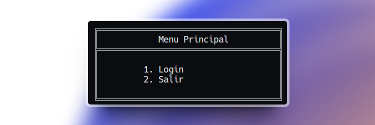</a>
</p>
<p align="center"></p>

<div align="center">
🙍‍♂️ Joab Israel Ajsivinac Ajsivinac 🆔 202200135
</div>
<div align="center">
📕 Estructura de Datos
</div>
<div align="center"> 🏛 Universidad San Carlos de Guatemala</div>
<div align="center"> 📆 Vacaciones Diciembre 2023</div>


# ⚽ Objetivos
* **Objetivo General**
    * Aplicar los conocimientos del curso de Estructuras de Datos en el desarrollo de diferentes estructuras de datos y los diferentes algoritmos de manipulación de información en ellas.
* **Objetivos Específicos**
    * Utilizar el lenguaje Go para implementar estructuras de datos no lineales.
    * Utilizar la herramienta Graphviz para graficar las estructuras de datos.
    * Definir e implementar algoritmos de ordenamiento, búsqueda e inserción en las diferentes estructuras a implementar


# 📍 Manual de Usuario

## ⚒ Requerimientos
<ul>
<li>Sistemas Opreativos</li>
    <ul>
        <li>Windows 8 o Superior</li>
        <li>macOS Catalina o Superior</li>
        <li>Linux: Ubuntu, Debian, CentOS, Fedora, etc.</li>
    </ul>
    <li>Go 1.21.4 o Superior</li>
</ul>


## 📟 Instalación
Descargue el código o bien clone el repositorio en una carpeta.

Si se opta por la clonación se hace con la siguiente linea de código en terminal (Antes de ejecutar el codigo asegurese de estar en la carpeta donde lo quiere descargar)

```bash
git clone https://github.com/J-Ajsivinac/EDD_VD2S2023_PY_202200135
```

## ⚡ Inicio Rápido
Una vez con la carpeta del proyecto y teniendo los recursos, abra la carpeta y en una consola ejecute el programa de la siguiente manera

```bash
go run main.go
```

Luego se imprimiran el menu de opciones

## 💻 Interfaz de Usuario y Funcionalidades
Al ejecutar la aplicación se desplegará el siguiente login para iniciar sesión:

<p align="center">
    <a href="#">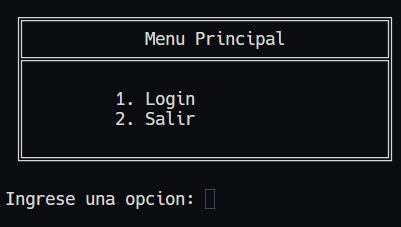</a>
</p>

Al elegir la opción login se cambiara de opciones por las 

<p align="center">
    <a href="#">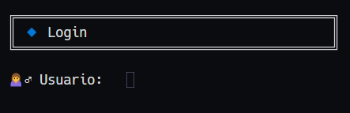</a>
</p>

Para ingresar como administrador ingrese:

**Usuario:**
```bash
ADMIN_202200135
```

**Contraseña:**
```bash
admin
```

Para ingresar como estudiante el usuario y contraseña son el número de carnet, siempre y cuando ya se tenga cargados los alumnos desde el administrador.

### Administrador
Al ingresar como administrador se visualizara el siguiente menú

<p align="center">
    <a href="#">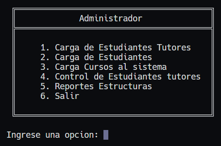</a>
</p>

**Carga de Estudaintes Tutores**

Al presionar la opción numero 1 se le solicitará ingresar la ruta del archivo que contiene a los tutores, el archivo tiene que ser un `.csv` para poder ser leido correctamente

<p align="center">
    <a href="#">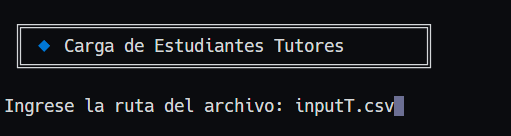</a>
</p>

**Carga de Estudaintes**

Al presionar la opción numero 2 se le solicitará ingresar la ruta del archivo que contiene a los estudiantes, el archivo tiene que ser un `.csv` para poder ser leido correctamente 

<p align="center">
    <a href="#">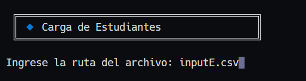</a>
</p>

Una vez cargados los tutores se regresara al menu de administrador.


**Carga de Cursos al Sistema**

Al presionar la opción numero 3 se le solicitará ingresar la ruta del archivo que contiene los cursos deseadso, el archivo tiene que ser un `.json` para poder ser leido correctamente 

<p align="center">
    <a href="#">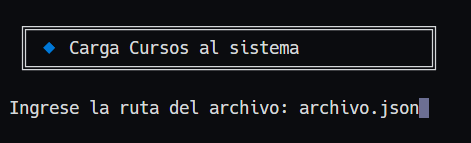</a>
</p>

Una vez cargados los tutores se regresara al menu de administrador.

**Control de Estudiantes tutores**

Al presionar la opción numero 4 se le solicitará aceptar o rechazar a los estudiantes tutores, en un menu propio

<p align="center">
    <a href="#">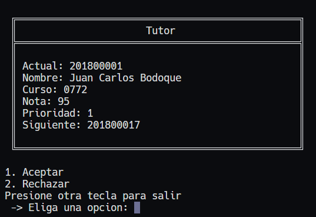</a>
</p>

Los alumnos se mostraran según el nivel de prioridad que se le asigno, en base a su nota. las prioridades son:

```
Prioridad 1: Alumnos tutores que tengan una nota entre 90-100
Prioridad 2: Alumnos tutores que tengan una nota entre 75-89
Prioridad 3: Alumnos tutores que tengan una nota entre 65–74
Prioridad 4: Alumnos tutores que tengan una nota entre 64-61
```

Una vez aceptados a todos los tutores se regresara al menu de administrador o bien si se presionr y dar enter ingresando otro numero diferente a 1 y 2.

**Reportes Estructuras**

Al presionar la opción numero 5 se mostrara un nuevo menu para poder elegir el tipo de reporte deseado:

<p align="center">
    <a href="#">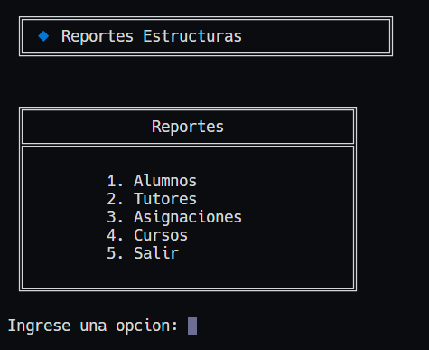</a>
</p>

Los resultados de los reportes son:

```
Alumnos: gráfica con los nombres y carnets de los alumnos 
Tutores: gráfica con los nombres y carnets de los tutores aceptados 
Alumnos: gráfica en forma de matriz con los carnets de los tutores y estudiantes como cabeceras y filas respectivamente 
Cursos: gráfica en forma de arbol donde se muestran los cursos guardados. 
```

Los reportes se guardan en una carpeta llamada reportes la cual se crea automaticamente si no existe.

### Alumno
Al ingresar como alumno se le mostrarán las siguientes opciones

<p align="center">
    <a href="#">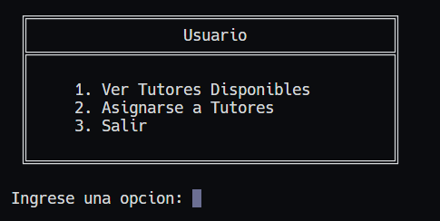</a>
</p>

**Ver Tutores Disponibles**
En esta opción se desplegará el listado de estudiantes tutores aceptados junto con el codigo del curso que tienen a su cargo
<p align="center">
    <a href="#">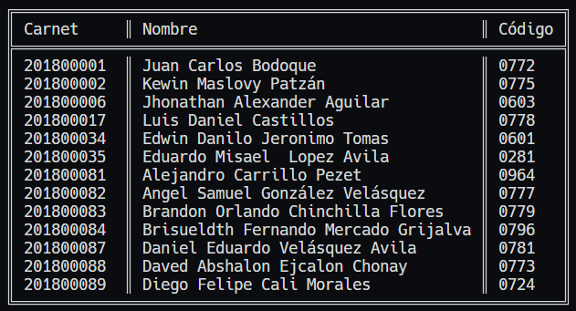</a>
</p>

**Asignarse a Tutores**

En esta opción se le solicitará el codigo del curso al cual se quiere asignar
<p align="center">
    <a href="#">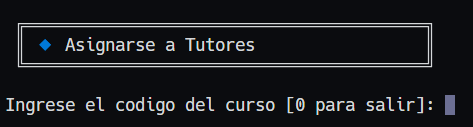</a>
</p>


### Parte inferior
La parte inferior esta dividida en 2 columnas, de la siguiente manera:

La primera columna donde se puede visualiza el nombre del archivo actual junto con su extención (Al inicio el nombre es Nuevo Documento.json) a si como el botón para ejecutar y el lugar donde se debe agregar el texto a analizar.

La segunda columna es donde se podrá visualizar las acciones escritas anteriormente.


# 📍 Manual Técnico

## ⚙ Tecnologías Utilizadas

<div align="center" style="display:flex;justify-content:center;gap:20px">
 <a href="https://skillicons.dev">
    
  </a>
</div>
<ul>
  <li>Go</li>
  <li>Visual Studio Code</li>
  <li>Git</li>
  <li>Graphviz</li>
</ul>

## 🧮 Como funciona

La aplicación se maneja desde el archivo `main.go`, teniendo las estructuras y otras funciones en la carpet pkg

<h3>Main</h3>

___

Dentro de este archivo se encuentran los menus, y la logica para cada parte de los diferentes menus, los menus están encerrados dentro de un bucle para poder volver a repetir las acciones las veces que el usuario las requiera.

Asi mismo, es en donde se implementan las estructuras necesarias para el manejo de datos como los son:

* Lista Doblemente Enlazada
* Cola Prioridad
* Lista Circular Doblemente Enlazada
* Matriz Dispersa
* Arból AVL

### PKG
___

Dentro de esta carpeta se encuantra el código para cada estructura de dato usada.

* **Lista Doblemente Enlazada**

En la lista doblemente enlazada se ingresan a los estudiantes que están buscando tutorias, mediante el método insertar:

```Go
func (l *ListaDobleE) Insertar(estudiante *Estudiante) {
	nuevo := &NodoDobleE{Estudiante: estudiante}
	if l.Primero == nil {
		l.Primero = nuevo
		l.Ultimo = nuevo
	} else {
		l.Ultimo.Siguiente = nuevo
		nuevo.Anterior = l.Ultimo
		l.Ultimo = nuevo
	}
	l.Longitud++
}
```
El cual se encarga de verificar si la lista esta vacia para poder asignar Primero, de lo contrario se usa la variable ultimo para poder agregar al nuevo estudiante.

A su vez en este método se encuentra la opción del login el cual hace un recorrido verificando la contraseña y el usuario ingresado para poder devolver un valor verdadero o false según el estado de encontrado en el que se encuentra.

```go
func (l *ListaDobleE) LoginUser(contra int, carnet int) bool {
	aux := l.Primero
	for aux != nil {
		if aux.Estudiante.Carnet == contra && carnet == contra {
			return true
		}
		aux = aux.Siguiente
	}
	return false
}
```

* **Lista Circular Doblemente Enlazada**

En la lista circular doblemente enlazada se ingresan a los estudiantes aprobados que van a dar las tutorías, mediante el método insertar:

```go
func (l *ListaCircularDoble) InsertarOrdenado(carnet int, nombre string, curso string, nota int) 
```
Esta función verifica que el estudiante ingresado sea el más adecuado para dar tutorias, para ello si anteriormente se agrego un estudiante para un curso y se quiere agregar otro al mismo curso el estudiante con mayor nota es el que dara las tutorias del curso.

La inserción se hace de forma ordenada según el carnet del estudiante, por lo que se contemplan 3 casos posibles para su insersión.

1. Qué sea el Primer estudiante
2. Que el nuevo carnet sea más pequeño que el del estudiante que esta como primero
3. Inserción al final o en medio de la lista

Dependiendo del caso se realizan diferentes acciones para poder insertar al alumno correctamente manteniendo el orden ascendente.

* **Cola de Prioridad**

En esta estructura se guardan los estudiantes luego de la lectura del archivo `.csv` para que posteriormente sean aceptados o rechazados, los alumnos se guardan por prioridad, siendo esa prioridad la siguiente:
```
Prioridad 1: Alumnos tutores que tengan una nota entre 90-100
Prioridad 2: Alumnos tutores que tengan una nota entre 75-89
Prioridad 3: Alumnos tutores que tengan una nota entre 65–74
Prioridad 4: Alumnos tutores que tengan una nota entre 64-61
```


Si los alumnos no llegan a 61, no se les tomará en cuenta y no se agregarán a la cola

En esta estructura se imprime la información para poder aceptar o rechazar a un tutor, mediante el metodo Primero

* **Matriz Dispersa**

En esta estructura se guarda la información de asignación de cursos, donde la cabecera los tutores y las filas son los estudiantes, y los datos entre ellas es el codigo del curso relacionado.

Este archivo cuenta con las siguientes funciones:

```go
func (m *Matriz) Insertar_Elemento(carnet_estudiante int, carnet_tutor int, curso string) {
	nodoColumna := m.buscarColumna(carnet_tutor, curso)
	nodoFila := m.buscarFila(carnet_estudiante)

	if nodoColumna == nil && nodoFila == nil {
        //Caso 1
	} else if nodoColumna != nil && nodoFila == nil {
		//Caso 2
	} else if nodoColumna == nil && nodoFila != nil {
		//Caso 3
	} else if nodoColumna != nil && nodoFila != nil {
		//Caso 4
	} else {
		fmt.Println("ERROR!!!")
	}
}
```

Para insertar datos a la matriz, se tienen 4 casos los cuales hacen diferentes acciones, esto en base a los resultados de los metodos buscar columna y buscar fila, los cuales devuelven el nodo columna y fila si encuentra una ya existente con los datos pasados por parametros

**Caso 1**

Es cuando el tutor y estudiante no están anteriormente en la matriz, se crea una nueva Columna y una nueva fila, aumentando la cantidad de alumnos y tutores, para luego insertar la fila y la nueva columna a la matriz.

**Caso 2**

Es cuando el alumno no esta registrado anteriormente pero el tutor si,  se crea una nueva Fila, aumentando la cantidad de alumnos, para luego insertarlos a la matriz

**Caso 3**

Es cuando el estudiante no existe pero el estudiante ya tiene un curso asignado, se crea una nueva columna para luego insertarlo en la matriz.

**Caso 4**

Es cuando el tutor y el estudiante existen por lo que solo se agrega la información del curso en la posición respectiva.

Si ninguno de los casos se cumple se muestra un error en consola

* **Arbol AVL**

En esta estructura se guardan los cursos, para esto se hacen varias verificaciones para poder asegurar que el arbol AVL este completo.

Para insertar un nuevo elemento se hace un llamado a insertarNodo.

```go
func (a *Arbol) insertarNodo(raiz *NodoArbol, nuevoNodo *NodoArbol) *NodoArbol {
	if raiz == nil {
		raiz = nuevoNodo
	} else {
		if raiz.Valor > nuevoNodo.Valor {
			raiz.Izquierdo = a.insertarNodo(raiz.Izquierdo, nuevoNodo)
		} else {
			raiz.Derecho = a.insertarNodo(raiz.Derecho, nuevoNodo)
		}
	}
	numeroMax := math.Max(float64(a.altura(raiz.Izquierdo)), float64(a.altura(raiz.Derecho)))
	raiz.Altura = 1 + int(numeroMax)
	balanceo := a.equilibrio(raiz)
	raiz.Factor_Equilibrio = balanceo
	if balanceo > 1 && nuevoNodo.Valor > raiz.Derecho.Valor {
		//Rotacion Simple a la Izquierda
	} else if balanceo < -1 && nuevoNodo.Valor < raiz.Izquierdo.Valor {
		//Rotacion Simple a la derecha
	} else if balanceo > 1 && nuevoNodo.Valor < raiz.Derecho.Valor {
		//Rotacion Doble a la Izquierda
	} else if balanceo < -1 && nuevoNodo.Valor > raiz.Izquierdo.Valor {
		//Rotacion Doble a la Derecha
	}
	return raiz
}
```

en este metodo se verifica primero si el elemento es el primero para poder asignarlo como raiz, si no lo es se verifica los valorres (en este caso los codigos de curso) para poder agregarlos a la izquierda o a la dereca
 
 ```
 Izquierda: Valores menores a la raiz
 Derecha: Valores mayores a la raiz
 ```

 Luego se obtiene el maximo entre las dos ramas (izquierda y derecha)
 y se llama a balancear, para luego verificar si se necesita realizar una rotación o no y si se debe hacer que tipo de rotación realizar.

**Rotación Simple a la Izquierda**
* El hijo derecho del nodo desequilibrado se convierte en el nuevo nodo raíz.
* El hijo izquierdo del nuevo nodo raíz se convierte en el hijo derecho del antiguo nodo raíz.
* Actualización de las alturas de los nodos afectados.
* 
**Rotación Simple a la Derecha**

* El hijo izquierdo del nodo desequilibrado se convierte en el nuevo nodo raíz.
* El hijo derecho del nuevo nodo raíz se convierte en el hijo izquierdo del antiguo nodo raíz.
* Actualización de las alturas de los nodos afectados.

**Rotación Doble a la Izquierda**

* Se realiza una rotación simple a la izquierda en el hijo izquierdo del nodo desequilibrado.
* Luego, se realiza una rotación simple a la derecha en el nodo desequilibrado.
* Actualización de las alturas de los nodos afectados.

**Rotación Doble a la Derecha**

* Se realiza una rotación simple a la derecha en el hijo derecho del nodo desequilibrado.
* Luego, se realiza una rotación simple a la izquierda en el nodo desequilibrado.
* Actualización de las alturas de los nodos afectados.

Para comprender de mejor manera el insertado de los nodos se muestra el siguiente video:

https://github.com/J-Ajsivinac/Tests/assets/123278178/32bd4ba5-4bb0-45bc-8886-9f2e2476245f

creditos: https://www.instagram.com/worldofivo/

El programa cuenta con la opción de generar Reportes para lo cual se crea un archivo en formato `.dot` para luego ejecutar el comando respectivo para generar un `.png` mostrando la información necesaria para ello se usan los métodos 

``` 
CrearArchivo()
EscribirArchivo()
Ejecutar()
```

El sistema cuenta con mensajes en consola con colores e iconos que ejemplifican el tipo de mensaje estos mensajes estan dentro de la carpeta utilities.

## 📷 Capturas de los Reportes
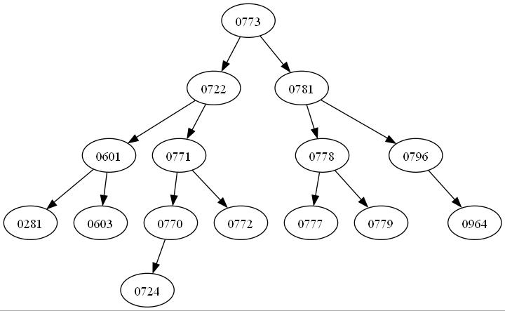
<p align="center">Grafica del arbol AVL</p>

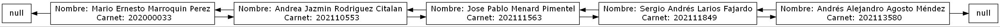
<p align="center">Gráfica de la lista doblemente enlazada</p>

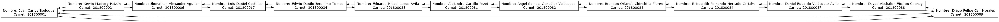
<p align="center">Gráfica de la lista circular doblemente enlazada</p>

<p align="center">
    <a href="#">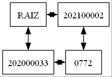</a>
</p>
<p align="center">Gráfica de la matriz dispersa</p>