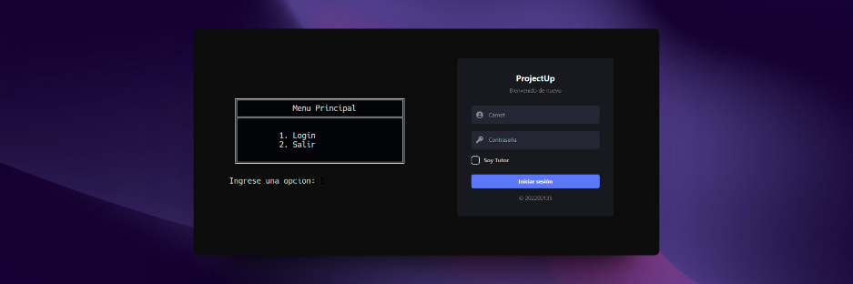

<h1 align="center">Proyecto Único</h1>

    

🙍‍♂️ Joab Israel Ajsivinac Ajsivinac

📕 Estructura de Datos

 🏛 Universidad San Carlos de Guatemala

 📆 Vacaciones Diciembre 2023

> [!IMPORTANT]  
> El proyecto esta dividido en 2 fases

> [!NOTE]  
> La Primera fase usa las siguientes estructuras:
> 
> * Árbol AVL
> * Lista Doblemente Enlazada
> * Lista Circular Doblemente Enlazada
> * Matriz Dispersa
> * Cola de prioridad.

> [!NOTE]  
> La Segunda fase usa las siguientes estructuras:
> 
> * Árbol B
> * Árbol de Merkle
> * Tabla Hash
> * Grafo